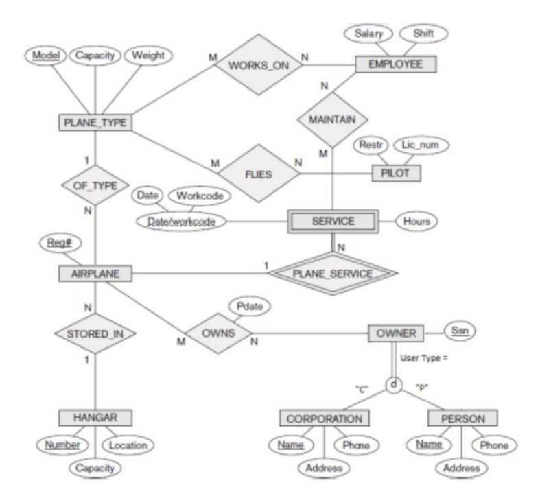

# MySQL-CheatSheet

## Table Of Contents
- [Create Table in Database](#Create-Table)
- [Insert value in Table of Database](#Insert-Value)
- [Display the Name with Different Style](#Display-Name)
- [Use of Concat](#Conact)
- [Insert Value Condition](#Condition)
- [Use of Alter](#Alter)
- [Use of Nested Query](#Nested-Query)
- [Type of Join](#Join)
- [Use of 'USING' Clause](#USING-clauses)

## Create Table
Example:
```SQL
create table persons (
ID int not null,
LastName varchar(255) not null,
FirstName varchar(255),
Age int check (age>=18),
city varchar(255) default 'Islamabad'
);
```

## Insert Value
Example:

```SQL
insert into persons(ID, LastName, FirstName, Age,city)
value(221544,'Ahmad','Radeel',20,'khushab');
```

## Display Name

### Which actors have the first name ‘Scarlett’
```SQL
select * from actor where first_name = 'Scarlett';
```

### Which actors have the last name ‘Johansson’

```SQL
select * from actor where last_name = 'Johansson';
```

### Find all actors whose last name contain the letters GEN:

```SQL
select * from actor where last_name = '%GEN%';
```

### Retrieve names of movies starting with S.

```SQL
select title from film where title like 'S%';
```

### Select release year of movies starting with M?

```SQL
select release_year from film where title like 'M%';
```

### Retrieve data of all actors whose names are not ending on T.

```SQL
select * from actor where last_name not like '%T';
```

## Conact

### Create a new table called customer_names with first_name, last_name, and full_name columns, where full_name combines first and last names of all customers.
```SQL
create table customer_name as select
First_name , Last_name , concat(first_name,' ',last_name ) as full_name
from customer;

select * from customer_name
```

## condition

### In this user must enter age above and greater then 18  
```SQL
create table persons (
ID int not null,
LastName varchar(255) not null,
FirstName varchar(255),
Age int check (age>=18),
city varchar(255) default 'Islamabad'
);
```

## Alter

### Change the Data type and condition
```SQL
alter table student modify age int check (age>=18 and age<=35) ;
alter table faculty modify fname VARCHAR(30);
alter table faculty modify deptid int not null;
alter table student add age int;
```

## Nested Query

### Less, Greater, Equal and Condition
```SQL
SELECT fName, lName, salary
FROM employee
WHERE salary > (SELECT AVG(salary)
FROM employee);
```

```SQL
SELECT fName, lName, salary
FROM employee
WHERE salary = (SELECT min(salary)
FROM employee);
```

```SQL
select fName, lName,salary
from employee where salary > (select salary
from employee
where fName like 'Ahmed')
```

### Find the names of all juniors (Level = JR) who are enrolled in a class taught by ‘Ivana Teach’.

```SQL
select s.sname from student s
where s.level = 'JR' and snum in (
select e.snum from
class c,
faculty f,
enrolled e
where e.cname = c.cname and
c.fid = f.fid and
f.fname = 'Ivana'
);
```

### Find eldest student in each level.

```SQL
SELECT s.level, s.sname, s.Age
FROM Student s
WHERE (s.level , s.Age) IN (
SELECT level, MAX(Age)
FROM Student GROUP BY level );
```

### Retrieve the snum and sname of students who have taken classes from both ‘Ivana Teach’ and ‘Linda Davis’.

```SQL
select s.snum, s.sname from student s
where s.snum in (
select e.snum from
enrolled e,
class c,
faculty f where
e.snum = s.snum and
e.cname = c.cname and
c.fid = f.fid and
f.fname = 'Ivana'
)
and s.snum in (
select e.snum from
enrolled e,
class c,
faculty f where
e.snum = s.snum and
e.cname = c.cname and
c.fid = f.fid and
f.fname = 'Linda'
)
```

## Join

### INNER JOIN
```SQL
SELECT members.first_name , members.last_name , movies.title
FROM members ,movies
WHERE movies.id = members.movie_id
```

### Cross JOIN

```SQL
SELECT * FROM `movies` CROSS JOIN `members`
```

### LEFT JOIN

```SQL
SELECT movies.title ,members.first_name, members.last_name
FROM movies
LEFT JOIN members
ON members.movie_id = movies.id
```

### RIGHT JOIN

```SQL
SELECT members.first_name , members.last_name , movies.title
FROM members
RIGHT JOIN movies
ON movies.id = members.movie_id
```

## USING clauses

```SQL
SELECT movies.title ,members.first_name , members.last_name
FROM movies
LEFT JOIN members
USING (movie_id) ;
```

---

### Consider the below conceptual schema which is designed for ordering systems. You are required to write necessary queries to convert this schema into relational database. Your queries must contain all type of constraints, checks, primary key foreign key relations and default values

<p align="center">
    
</p>

### Query

```SQL
CREATE DATABASE Airport;

USE Airport; 
 
CREATE TABLE PLANE_TYPE ( 
    Model VARCHAR(50) PRIMARY KEY, 
    Capacity INT NOT NULL CHECK (Capacity > 0), 
    Weight DECIMAL(10, 2) NOT NULL CHECK (Weight > 0) 
); 
 
CREATE TABLE HANGAR ( 
    Number INT PRIMARY KEY, 
    Location VARCHAR(100) NOT NULL, 
    Capacity INT NOT NULL CHECK (Capacity > 0) 
); 
 
CREATE TABLE AIRPLANE ( 
    RegNo VARCHAR(20) PRIMARY KEY, 
    Model VARCHAR(50) NOT NULL, 
    HangerNo INT NOT NULL, 
    FOREIGN KEY (Model) REFERENCES PLANE_TYPE (Model), 
    FOREIGN KEY (HangerNo) REFERENCES HANGAR (Number) 
); 
 
CREATE TABLE EMPLOYEE ( 
    Ssn VARCHAR(20) PRIMARY KEY, 
    Salary DECIMAL(10, 2) NOT NULL CHECK (Salary >= 0), 
    Shift VARCHAR(20) DEFAULT 'Day' 
); 
 
CREATE TABLE PILOT ( 
    Lic_num VARCHAR(20) PRIMARY KEY, 
    Restriction VARCHAR(50) 
); 
 
CREATE TABLE WORKS_ON ( 
    Ssn VARCHAR(20), 
    Model VARCHAR(50), 
    PRIMARY KEY (Ssn, Model), 
    FOREIGN KEY (Ssn) REFERENCES EMPLOYEE (Ssn), 
    FOREIGN KEY (Model) REFERENCES PLANE_TYPE (Model) 
); 
 
CREATE TABLE FLIES ( 
    Lic_num VARCHAR(20), 
    Model VARCHAR(50), 
    PRIMARY KEY (Lic_num, Model), 
    FOREIGN KEY (Lic_num) REFERENCES PILOT (Lic_num), 
    FOREIGN KEY (Model) REFERENCES PLANE_TYPE (Model) 
); 
 
CREATE TABLE OWNER ( 
    Ssn VARCHAR(20) PRIMARY KEY, 
    User_Type CHAR(1) CHECK (User_Type IN ('C', 'P')) 
); 
 
CREATE TABLE CORPORATION ( 
    Ssn VARCHAR(20) PRIMARY KEY, 
    Name VARCHAR(100) NOT NULL, 
    Phone VARCHAR(20), 
    Address VARCHAR(200), 
    FOREIGN KEY (Ssn) REFERENCES OWNER (Ssn) 
); 
 
CREATE TABLE PERSON ( 
    Ssn VARCHAR(20) PRIMARY KEY, 
    Name VARCHAR(100) NOT NULL, 
    Phone VARCHAR(20), 
    Address VARCHAR(200), 
    FOREIGN KEY (Ssn) REFERENCES OWNER (Ssn) 
); 
 
CREATE TABLE OWNS ( 
    Ssn VARCHAR(20), 
    RegNo VARCHAR(20), 
    Pdate DATE NOT NULL, 
    PRIMARY KEY (Ssn, RegNo), 
    FOREIGN KEY (Ssn) REFERENCES OWNER (Ssn), 
    FOREIGN KEY (RegNo) REFERENCES AIRPLANE (RegNo) 
); 
 
CREATE TABLE SERVICE ( 
    Workcode VARCHAR(20) PRIMARY KEY, 
    Date DATE, 
    Hours DECIMAL(5, 2) CHECK (Hours > 0), 
    RegNo VARCHAR(20) NOT NULL, 
    FOREIGN KEY (RegNo) REFERENCES AIRPLANE (RegNo) 
); 
 
CREATE TABLE MAINTAIN ( 
    Ssn VARCHAR(20), 
    Workcode VARCHAR(20), 
    PRIMARY KEY (Ssn, Workcode), 
    FOREIGN KEY (Ssn) REFERENCES EMPLOYEE (Ssn), 
    FOREIGN KEY (Workcode) REFERENCES SERVICE (Workcode) 
);
```
